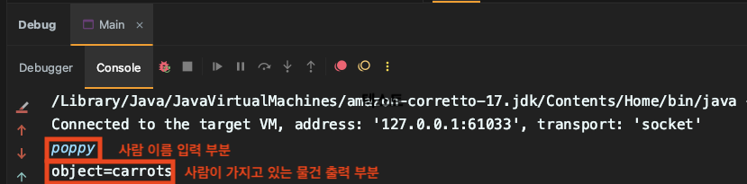

# 서버/백엔드(Java) 개발자 코딩 과제

## 환경
* Java 17
* Gradle

## 설명
데이터 파일(csv) 에 있는 데이터를 읽어, 사람(name)이 가지고 있는 물건(object)을 조회합니다.

### 동작
1. 데이터 파일(csv)를 읽어 메모리에 저장합니다.
2. 조회는 `main` method 실행시 `scanner`를 통해 `stdin`으로 사람 이름(name)을 입력합니다.
3. 메모리에서 사람 이름(name)으로 조회하여, 가지고 있는 물건을 `stdout` 으로 출력합니다.
   1. 출력시 `System.out.pringln(..)`을 사용합니다.

### 예시

### 기본 소스코드 설명 
* 데이터 파일(csv) 읽는 부분은 기본 소스코드에서 제공합니다.
* `scanner`를 사용하여 `stdin` 부분은 기본 소스코드에서 제공합니다.

